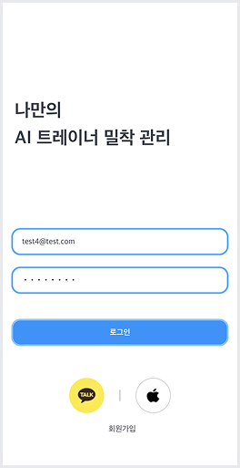
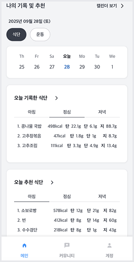
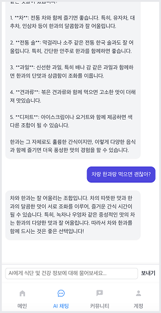
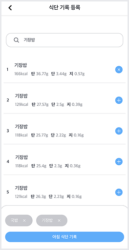
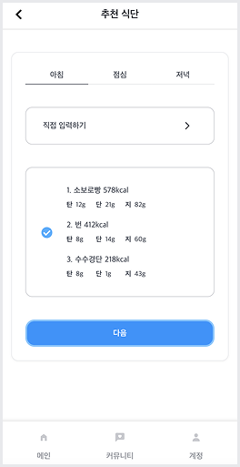
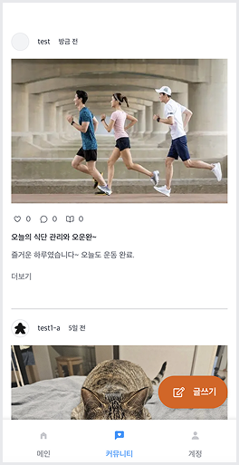
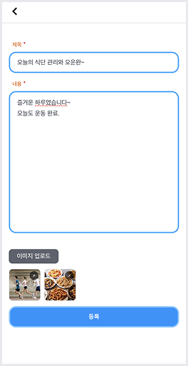

# 🏋️ HelloFit - AI 기반 건강 관리 서비스

> 나만의 AI 트레이너가 식단과 운동을 밀착 관리해주는 헬스케어 플랫폼

## 📸 스크린샷

| 로그인 | 메인 화면 | AI 채팅 |
|:---:|:---:|:---:|
|  |  |  |

| 식단 검색 | 추천 식단 | 커뮤니티 |
|:---:|:---:|:---:|
|  |  |  |

| 게시글 작성 |
|:---:|
|  |

---

## 📌 참고사항

- 현재 ai-hellofit-frontend 헬로핏 프로젝트만 개발 중입니다.
- 다른 프로젝트는 모노레포 구성을 위한 더미 프로젝트입니다.

---

## ✨ 주요 기능

### 🤖 AI 건강 챗봇
- WebSocket 기반 실시간 AI 채팅
- 식단 및 건강 정보에 대한 맞춤형 상담
- LLM을 활용한 자연스러운 대화 경험

### 🥗 식단 관리 & 추천
- 음식 검색 및 영양 정보 조회 (칼로리, 탄수화물, 단백질, 지방)
- 일별 식단 기록 (아침/점심/저녁)
- AI 기반 맞춤 식단 추천
- 주간/월간 캘린더 뷰로 식단 기록 확인
- 최근 7일 영양소 섭취 차트

### 👥 커뮤니티
- 게시글 작성/수정/삭제
- 이미지 업로드 (AWS S3)
- 댓글 기능
- 좋아요 기능

### 👤 사용자 관리
- 소셜 로그인 (카카오, 애플)
- 사용자 프로필 등록 (성별, 나이, 키, 몸무게, 운동 시간 등)
- 마이페이지 (프로필 수정, 내 게시글/댓글 조회)

---

## 🏗️ 시스템 아키텍처

```
┌─────────────────┐     ┌─────────────────┐     ┌─────────────────┐
│                 │     │                 │     │                 │
│   Frontend      │────▶│   App Server    │────▶│   AI Server     │
│   (Next.js)     │     │  (Spring Boot)  │     │   (FastAPI)     │
│                 │◀────│                 │◀────│                 │
└─────────────────┘     └─────────────────┘     └────────┬────────┘
                                                         │
                                                         ▼
                                                ┌─────────────────┐
                                                │   External      │
                                                │   LLM API       │
                                                └─────────────────┘
```

- **Frontend**: Next.js 15 + React 19 기반 웹 애플리케이션
- **App Server**: Spring Boot 기반 REST API 서버
- **AI Server**: FastAPI 기반 LLM 서비스 서버
- **External LLM API**: 외부 LLM API 연동

---

## 📅 개발 기간

- **시작일**: 2025.07.08
- **상태**: 🚧 개발 진행 중

---

## 🔗 관련 링크

### 깃 저장소

| 저장소 | 링크 |
|:---|:---|
| Frontend | [yunyami0605/Full-Portfolio](https://github.com/yunyami0605/Full-Portfolio) |
| App Server | [yunyami0605/hellofit_server](https://github.com/yunyami0605/hellofit_server) |
| LLM Server | [yunyami0605/hellofit_llm](https://github.com/yunyami0605/hellofit_llm) |

### 산출물

| 문서 | 링크 |
|:---|:---|
| 프로젝트 기획서 | [Notion 링크](https://cookiejy.notion.site/29e75abb802d808ab2afd94e32524708?source=copy_link) |
| 시스템 아키텍처 설계서 | [Notion 링크](https://cookiejy.notion.site/29f75abb802d803b8ffedb2a1af0915f?source=copy_link) |
| 데이터베이스 설계서 | [Notion 링크](https://cookiejy.notion.site/29f75abb802d8006b09dc395b8797c6c?source=copy_link) |
| 기능 명세서 | [Notion 링크](https://cookiejy.notion.site/29f75abb802d80158670fee0596f4e82?v=29f75abb802d8028b2ab000c5e6efc0d) |

---

## 📁 폴더 구조 (모노레포)

```
.
├── apps/                    # 프로젝트 폴더
│   ├── ai-hellofit-frontend # 헬로핏 프로젝트
│   └── ...                  # 다른 프로젝트
├── packages/                # 공통 설정/훅/ui 프로젝트 폴더
│   ├── config               # 공통 설정
│   ├── hooks                # 공통 훅
│   └── ui                   # 공통 UI 컴포넌트
└── shell-script/            # 명령어 쉘스크립트 폴더
    └── create-feature.sh
```

---

## 🛠️ 기술 스택

| 분류 | 기술 |
|:---|:---|
| Package Manager | Yarn 4 Workspaces |
| Framework | Next.js 15, React 19 |
| Language | TypeScript |
| State Management | React Query, Zustand |
| Styling | SCSS Modules |
| Testing | Vitest, React Testing Library |
| Mocking | MSW (Mock Service Worker) |

---

## 🚀 실행 방법

- 루트에서 다음 명령어를 실행합니다.

```bash
# 의존성 설치
yarn install

# HelloFit 실행
yarn dev:fit

# 테스트 실행
yarn test:fit

# Lint 검사
yarn lint:fit
```

---

## 🌿 브랜치 전략

### 브랜치 네이밍

```
[프로젝트]/[액션]
예) ai-hellofit/feature
```

### 브랜치 종류

| 브랜치 | 설명 |
|:---|:---|
| `feature` | 기능 개발 브랜치 |
| `main` | 통합 브랜치 |
| `release` | 배포 브랜치 |
| `hotfix` | 긴급 수정 브랜치 |

### 커밋 컨벤션

| Prefix | 설명 |
|:---|:---|
| `feat` | 새로운 기능 추가 |
| `chore` | 라이브러리 설치/설정/에셋 추가 |
| `git` | git 관련 설정 |
| `docs` | 문서 추가 및 수정 |
| `refactor` | 코드 리팩토링 |
| `style` | UI 추가/수정 |

---

## 📝 코드 컨벤션

### 폴더 구조

| 폴더 | 설명 |
|:---|:---|
| `src/app` | 페이지 단위 폴더 |
| `src/features` | 기능 단위 폴더 |
| `src/shared` | 공통 컴포넌트, 스타일, 타입 |
| `src/libs` | 공통 유틸리티 |

### 네이밍 규칙

| 대상 | 규칙 | 예시 |
|:---|:---|:---|
| 함수/변수 | camelCase | `getUserInfo` |
| 컴포넌트 | PascalCase | `UserProfile.tsx` |
| SCSS 파일 | PascalCase + Module | `UserProfile.module.scss` |
| 타입/인터페이스 | PascalCase | `UserData` |

### CSS 규칙

- CSS classname: `snake_case` 형태
- 색상값은 변수로 관리
- mixin 적극 활용
- 단위: `rem` 사용 (10px = 1rem)
- 전역 SCSS 제외, 모두 모듈 형식
